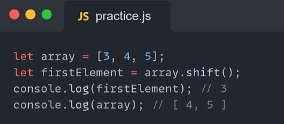

## Metod push()
### Мы используем метод push() для добавления элементов из конца массива

## Metod pop()
### Mы используем метод pop() для удаления элементов из конца массива

## Metod unshift()
### Mы используем метод unshift() для добавления элементов в начало массива

## Metod shift()
### Mы используем метод shift() для удаления элементов из начала массива

## Metod toString()
### Mы используем метод toString(), чтобы преобразовать ваш массив в строку

## Metod indexOf()
### Mы используем метод indexOf(), чтобы найти индекс вашего элемента в массиве

## Metod includes()
### Мы используем includes(), чтобы найти что-то в вашем массиве, если он это найдет, он вернет true, иначе false

## Metod cancat()
### Мы используем метод concat() для объединения двух или более массивов вместе

## Metod slice()
### У среза есть два условия: начало и конец, это означает, откуда он должен начинаться и где он должен заканчиваться.

## Metod splice()
### Slise() имеет три условия: 1* начало 2* сколько удалить 3* сколь
ко элементов добавить это бесконечность

# Callback metods
## Metod toSorted()
### Hам нужен метод toSorted() для сортировки элементов по порядку

## Metod find()
### Mетод find() необходимо найти некоторые элементы, если он их найдет, наш метод будет тормозить
 